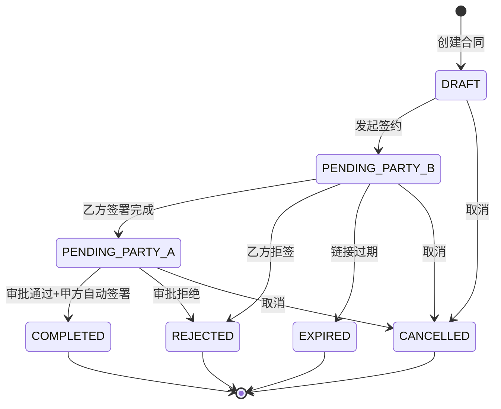

# Design Document: 腾讯电子签便捷签约系统

## Overview

本系统是一个基于Next.js 14的全栈应用，集成腾讯电子签API实现合同签署管理。系统采用App Router架构，使用Server Actions处理后端逻辑，Prisma ORM连接阿里云MySQL数据库。

**系统特点：**
- 三级角色体系：系统管理员 + 城市管理员 + 普通用户
- 双端设计：管理端（PC为主）+ 移动端（普通用户）
- 多城市数据隔离与模板配置
- 产品与合同模板绑定
- 签署流程：乙方先签 → 城市管理员审批 → 甲方自动签署

**技术栈：**
- 前端：Next.js 14 (App Router) + React 18 + TypeScript + Tailwind CSS + Ant Design
- 移动端：响应式设计 + PWA支持
- 后端：Next.js API Routes + Server Actions
- 数据库：阿里云 RDS MySQL + Prisma ORM
- 认证：NextAuth.js (Credentials Provider + Phone Provider)
- 部署：阿里云 ECS + Nginx

## Architecture

```
┌─────────────────────────────────────────────────────────────────┐
│                         Client (Browser)                         │
└─────────────────────────────┬───────────────────────────────────┘
                              │
                              ▼
┌─────────────────────────────────────────────────────────────────┐
│                      Next.js Application                         │
│  ┌─────────────────┐  ┌─────────────────┐  ┌─────────────────┐  │
│  │   Pages/Routes  │  │  Server Actions │  │   API Routes    │  │
│  │   (App Router)  │  │  (Form Actions) │  │  (Callbacks)    │  │
│  └────────┬────────┘  └────────┬────────┘  └────────┬────────┘  │
│           │                    │                    │            │
│           └────────────────────┼────────────────────┘            │
│                                │                                 │
│  ┌─────────────────────────────┴─────────────────────────────┐  │
│  │                     Service Layer                          │  │
│  │  ┌──────────┐ ┌──────────┐ ┌──────────┐ ┌──────────────┐  │  │
│  │  │  Auth    │ │ Contract │ │  Esign   │ │     SMS      │  │  │
│  │  │ Service  │ │ Service  │ │ Service  │ │   Service    │  │  │
│  │  └──────────┘ └──────────┘ └──────────┘ └──────────────┘  │  │
│  └─────────────────────────────┬─────────────────────────────┘  │
│                                │                                 │
│  ┌─────────────────────────────┴─────────────────────────────┐  │
│  │                    Prisma ORM Layer                        │  │
│  └─────────────────────────────┬─────────────────────────────┘  │
└────────────────────────────────┼────────────────────────────────┘
                                 │
          ┌──────────────────────┼──────────────────────┐
          │                      │                      │
          ▼                      ▼                      ▼
┌─────────────────┐  ┌─────────────────┐  ┌─────────────────────┐
│  阿里云 MySQL   │  │  腾讯电子签 API  │  │  腾讯云 SMS API     │
│    (RDS)        │  │                 │  │   (备用)            │
└─────────────────┘  └─────────────────┘  └─────────────────────┘
```

## Components and Interfaces

### 1. 页面路由结构

```
app/
├── (auth)/
│   ├── admin/
│   │   └── login/
│   │       └── page.tsx          # 管理员登录页面
│   └── mobile/
│       └── login/
│           └── page.tsx          # 移动端登录页面
├── (dashboard)/                  # 管理端（PC为主）
│   ├── layout.tsx                # 后台布局（侧边栏+顶栏）
│   ├── page.tsx                  # 仪表盘首页
│   ├── contracts/
│   │   ├── page.tsx              # 签约管理列表
│   │   ├── [id]/
│   │   │   └── page.tsx          # 签约详情
│   │   └── new/
│   │       └── page.tsx          # 发起签约
│   ├── cities/
│   │   └── page.tsx              # 城市管理
│   ├── products/
│   │   └── page.tsx              # 产品管理
│   └── users/
│       └── page.tsx              # 用户管理
├── (mobile)/                     # 移动端（普通用户）
│   ├── layout.tsx                # 移动端布局（底部导航）
│   ├── page.tsx                  # 移动端首页
│   ├── contracts/
│   │   ├── page.tsx              # 我的签约列表
│   │   ├── [id]/
│   │   │   └── page.tsx          # 签约详情
│   │   └── new/
│   │       └── page.tsx          # 发起签约
│   └── profile/
│       └── page.tsx              # 个人中心
├── api/
│   ├── auth/
│   │   └── [...nextauth]/
│   │       └── route.ts          # NextAuth配置
│   ├── callback/
│   │   └── esign/
│   │       └── route.ts          # 腾讯电子签回调
│   └── cron/
│       └── sync-status/
│           └── route.ts          # 定时同步状态
└── layout.tsx                    # 根布局
```

### 2. 核心服务接口

```typescript
// services/esign.service.ts
interface EsignService {
  // 创建签署流程
  createFlow(params: CreateFlowParams): Promise<CreateFlowResult>;
  // 创建电子文档
  createDocument(params: CreateDocumentParams): Promise<CreateDocumentResult>;
  // 发起签署流程
  startFlow(flowId: string): Promise<StartFlowResult>;
  // 获取签署链接
  createFlowSignUrl(params: CreateSignUrlParams): Promise<SignUrlResult>;
  // 查询流程状态
  describeFlowInfo(flowId: string): Promise<FlowInfo>;
  // 触发自动签署
  triggerAutoSign(flowId: string): Promise<AutoSignResult>;
}

// services/contract.service.ts
interface ContractService {
  // 创建合同（草稿）
  createDraft(data: ContractDraftData): Promise<Contract>;
  // 发起签约
  initiateContract(contractId: string): Promise<Contract>;
  // 获取合同列表
  getContracts(filters: ContractFilters): Promise<PaginatedContracts>;
  // 获取合同详情
  getContractById(id: string): Promise<ContractDetail>;
  // 更新合同状态
  updateStatus(id: string, status: ContractStatus): Promise<Contract>;
  // 审批合同
  approveContract(id: string, approved: boolean, reason?: string): Promise<Contract>;
  // 重新生成签署链接
  regenerateSignUrl(contractId: string): Promise<SignUrlResult>;
}

// services/auth.service.ts
interface AuthService {
  // 密码登录
  loginWithPassword(username: string, password: string): Promise<AuthResult>;
  // 发送验证码
  sendVerificationCode(phone: string): Promise<void>;
  // 验证码登录
  loginWithCode(phone: string, code: string): Promise<AuthResult>;
  // 验证会话
  validateSession(token: string): Promise<User | null>;
}
```

### 3. API接口设计

```typescript
// 腾讯电子签回调接口
// POST /api/callback/esign
interface EsignCallbackPayload {
  FlowId: string;
  FlowStatus: number;  // 1-签署中 2-已完成 3-已拒签 4-已过期
  ApproverInfos: Array<{
    ApproverType: number;
    ApproverName: string;
    ApproverStatus: number;
  }>;
  Timestamp: number;
  Sign: string;
}

// 定时同步接口
// GET /api/cron/sync-status
// 由阿里云定时任务触发，同步待处理合同状态
```

## Data Models

### Prisma Schema

```prisma
// prisma/schema.prisma

generator client {
  provider = "prisma-client-js"
}

datasource db {
  provider = "mysql"
  url      = env("DATABASE_URL")
}

// 用户表
model User {
  id            String    @id @default(cuid())
  username      String?   @unique  // 普通用户可以没有用户名
  password      String?   // 普通用户可以没有密码（仅验证码登录）
  phone         String    @unique
  name          String
  role          Role      @default(ORDINARY_USER)
  cityId        String?
  city          City?     @relation(fields: [cityId], references: [id])
  isActive      Boolean   @default(true)
  lastLoginAt   DateTime?
  createdAt     DateTime  @default(now())
  updatedAt     DateTime  @updatedAt
  
  contracts     Contract[] @relation("CreatedBy")
  approvals     Contract[] @relation("ApprovedBy")
  auditLogs     AuditLog[]
  
  @@index([cityId])
  @@index([phone])
}

enum Role {
  SYSTEM_ADMIN
  CITY_ADMIN
  ORDINARY_USER
}

// 城市表
model City {
  id          String    @id @default(cuid())
  name        String    @unique
  description String?
  isActive    Boolean   @default(true)
  createdAt   DateTime  @default(now())
  updatedAt   DateTime  @updatedAt
  
  users       User[]
  contracts   Contract[]
  products    CityProduct[]
  
  @@index([isActive])
}

// 产品表
model Product {
  id              String    @id @default(cuid())
  name            String
  description     String?
  templateId      String    // 腾讯电子签模板ID
  formFields      Json?     // 需要填充的表单字段配置
  isActive        Boolean   @default(true)
  createdAt       DateTime  @default(now())
  updatedAt       DateTime  @updatedAt
  
  contracts       Contract[]
  cities          CityProduct[]
  
  @@index([isActive])
}

// 城市-产品关联表
model CityProduct {
  id        String   @id @default(cuid())
  cityId    String
  productId String
  city      City     @relation(fields: [cityId], references: [id])
  product   Product  @relation(fields: [productId], references: [id])
  createdAt DateTime @default(now())
  
  @@unique([cityId, productId])
}

// 合同表
model Contract {
  id              String          @id @default(cuid())
  contractNo      String          @unique  // 合同编号
  flowId          String?         @unique  // 腾讯电子签流程ID
  
  // 产品和城市
  productId       String
  product         Product         @relation(fields: [productId], references: [id])
  cityId          String
  city            City            @relation(fields: [cityId], references: [id])
  
  // 乙方信息
  partyBName      String
  partyBPhone     String
  partyBIdCard    String?
  partyBType      PartyType       @default(PERSONAL)  // 个人/企业
  partyBOrgName   String?         // 乙方企业名称（如果是企业）
  
  // 表单数据
  formData        Json?           // 填充到合同的表单数据
  
  // 状态
  status          ContractStatus  @default(DRAFT)
  signUrl         String?         // 当前签署链接
  signUrlExpireAt DateTime?       // 签署链接过期时间
  
  // 审批
  approvedAt      DateTime?
  approvedById    String?
  approvedBy      User?           @relation("ApprovedBy", fields: [approvedById], references: [id])
  rejectionReason String?
  
  // 创建信息
  createdById     String
  createdBy       User            @relation("CreatedBy", fields: [createdById], references: [id])
  createdAt       DateTime        @default(now())
  updatedAt       DateTime        @updatedAt
  completedAt     DateTime?
  
  // 关联
  statusLogs      ContractStatusLog[]
  
  @@index([status])
  @@index([cityId])
  @@index([partyBPhone])
  @@index([createdAt])
  @@index([flowId])
}

enum PartyType {
  PERSONAL
  ENTERPRISE
}

enum ContractStatus {
  DRAFT              // 草稿
  PENDING_PARTY_B    // 待乙方签署
  PENDING_PARTY_A    // 待甲方签署（待审批）
  COMPLETED          // 已完成签署
  REJECTED           // 已拒签
  EXPIRED            // 已过期
  CANCELLED          // 已取消
}

// 合同状态变更日志
model ContractStatusLog {
  id          String         @id @default(cuid())
  contractId  String
  contract    Contract       @relation(fields: [contractId], references: [id])
  fromStatus  ContractStatus?
  toStatus    ContractStatus
  operatorId  String?
  operatorName String?
  remark      String?
  createdAt   DateTime       @default(now())
  
  @@index([contractId])
  @@index([createdAt])
}

// 审计日志
model AuditLog {
  id          String    @id @default(cuid())
  userId      String?
  user        User?     @relation(fields: [userId], references: [id])
  action      String    // LOGIN, LOGOUT, CREATE_CONTRACT, APPROVE, etc.
  resource    String?   // 资源类型
  resourceId  String?   // 资源ID
  details     Json?     // 详细信息
  ip          String?
  userAgent   String?
  createdAt   DateTime  @default(now())
  
  @@index([userId])
  @@index([action])
  @@index([createdAt])
}

// 验证码表
model VerificationCode {
  id        String   @id @default(cuid())
  phone     String
  code      String
  type      String   @default("LOGIN")  // LOGIN, RESET_PASSWORD
  attempts  Int      @default(0)
  expiresAt DateTime
  usedAt    DateTime?
  createdAt DateTime @default(now())
  
  @@index([phone, type])
  @@index([expiresAt])
}

// 系统配置表
model SystemConfig {
  id        String   @id @default(cuid())
  key       String   @unique
  value     String   @db.Text
  createdAt DateTime @default(now())
  updatedAt DateTime @updatedAt
}
```

### 状态流转图




## Correctness Properties

*A property is a characteristic or behavior that should hold true across all valid executions of a system—essentially, a formal statement about what the system should do. Properties serve as the bridge between human-readable specifications and machine-verifiable correctness guarantees.*

Based on the prework analysis, the following correctness properties have been identified for property-based testing:

### Property 1: Authentication Correctness

*For any* valid username/password combination stored in the database, authentication SHALL succeed and return a valid JWT token. *For any* invalid credentials, authentication SHALL fail with an appropriate error.

**Validates: Requirements 1.2, 1.4, 1.5**

### Property 2: Verification Code Round-Trip

*For any* generated verification code for a phone number, storing and then retrieving the code within the expiration window SHALL return the same code value.

**Validates: Requirements 1.3, 1.4**

### Property 3: JWT Token Validity

*For any* successfully authenticated user, the generated JWT token SHALL contain the correct user ID, role, and city ID, and SHALL be verifiable with the system's secret key.

**Validates: Requirements 1.7**

### Property 4: Contract Status State Machine

*For any* contract and *for any* attempted status transition, the system SHALL only allow transitions that are valid according to the state machine: DRAFT→PENDING_PARTY_B, PENDING_PARTY_B→{PENDING_PARTY_A, REJECTED, EXPIRED}, PENDING_PARTY_A→{COMPLETED, REJECTED}. All other transitions SHALL be rejected.

**Validates: Requirements 5.1, 5.2, 5.3, 5.4, 5.5, 5.6, 5.7, 5.8**

### Property 5: City-Based Data Isolation

*For any* City_Admin user and *for any* query operation, the returned contracts SHALL only include contracts belonging to the user's assigned city. Contracts from other cities SHALL never be visible.

**Validates: Requirements 3.1, 8.7**

### Property 6: Input Validation Consistency

*For any* Party_B information input, the validation function SHALL return true if and only if: name is non-empty, phone matches Chinese mobile pattern (1[3-9]\d{9}), and ID card (if provided) matches valid format. Invalid inputs SHALL always be rejected with specific error messages.

**Validates: Requirements 2.3, 2.4**

### Property 7: Contract Initiation Flow Integrity

*For any* valid contract initiation request, the system SHALL execute API calls in the correct order (CreateFlow → CreateDocument → StartFlow → CreateFlowSignUrl), and if any step fails, the contract status SHALL remain unchanged or be rolled back appropriately.

**Validates: Requirements 2.5, 2.6, 2.7, 2.8, 2.12**

### Property 8: Contract Creation Invariant

*For any* successfully created contract, the contract SHALL have a unique contract number, be associated with a valid product and city, and have initial status of DRAFT (if saved as draft) or PENDING_PARTY_B (if submitted).

**Validates: Requirements 2.11, 2.13, 5.1, 5.2**

### Property 9: Status Filter Correctness

*For any* status filter applied to the contract list, all returned contracts SHALL have exactly the specified status, and no contracts with other statuses SHALL be included.

**Validates: Requirements 3.2**

### Property 10: Search Result Correctness

*For any* search query by Party_B name or phone, all returned contracts SHALL contain the search term in the corresponding field (case-insensitive for name, exact match for phone).

**Validates: Requirements 3.3**

### Property 11: Date Range Filter Correctness

*For any* date range filter, all returned contracts SHALL have creation time within the specified range (inclusive).

**Validates: Requirements 3.4**

### Property 12: Callback Processing Correctness

*For any* valid callback from Tencent E-Sign with verified signature, the contract status SHALL be updated to match the callback status: FlowStatus=2 → COMPLETED, FlowStatus=3 → REJECTED, FlowStatus=4 → EXPIRED.

**Validates: Requirements 3.8, 10.3, 10.4, 10.5**

### Property 13: Audit Log Completeness

*For any* contract status change, an audit log entry SHALL be created containing: contract ID, from status, to status, operator ID (if applicable), and timestamp.

**Validates: Requirements 5.9**

### Property 14: Password Encryption Round-Trip

*For any* user password, encrypting with bcrypt and then verifying the original password against the hash SHALL return true. Verifying any different password SHALL return false.

**Validates: Requirements 12.1**

### Property 15: API Request Signature Correctness

*For any* Tencent Cloud API request, the generated signature SHALL be valid according to TC3-HMAC-SHA256 algorithm and SHALL be accepted by the API endpoint.

**Validates: Requirements 9.2**

### Property 16: Role-Based Access Control

*For any* user with CITY_ADMIN role, access to system-admin-only resources (city management, user management, global product management) SHALL be denied. *For any* user with SYSTEM_ADMIN role, access to all resources SHALL be granted.

**Validates: Requirements 14.6, 14.7**

## Mobile Interface Design

### 移动端架构设计

移动端采用响应式设计，为普通用户提供专门优化的界面：

```
移动端页面结构:
├── /m/login          # 移动端登录（仅验证码）
├── /m/               # 移动端首页（合同概览）
├── /m/contracts      # 我的签约列表
├── /m/contracts/new  # 发起签约（移动优化）
├── /m/contracts/[id] # 签约详情（移动优化）
└── /m/profile        # 个人中心
```

### 移动端UI组件设计

**1. 移动端布局**
- 底部导航栏：首页、签约、发起、个人
- 顶部状态栏：标题、返回按钮、操作按钮
- 卡片式布局：适合触摸操作

**2. 移动端表单**
- 大按钮设计（最小44px触摸区域）
- 移动端键盘优化（数字键盘、电话键盘）
- 步骤式表单：分步骤填写，减少认知负担

**3. 移动端列表**
- 卡片式合同列表
- 下拉刷新和上拉加载
- 快速筛选标签

**4. 移动端分享**
- 微信分享集成
- 短信发送
- 二维码生成和显示
- 复制链接功能

### 响应式断点

```css
/* 移动端优先设计 */
.mobile-first {
  /* 默认移动端样式 */
}

@media (min-width: 768px) {
  /* 平板样式 */
}

@media (min-width: 1024px) {
  /* 桌面样式 */
}
```

### PWA支持

- Service Worker缓存
- 离线数据查看
- 添加到主屏幕
- 推送通知支持

## Error Handling

### API Error Handling

```typescript
// 腾讯电子签API错误处理
interface EsignApiError {
  code: string;
  message: string;
  requestId: string;
}

const ERROR_MESSAGES: Record<string, string> = {
  'FailedOperation': '操作失败，请稍后重试',
  'InvalidParameter': '参数错误，请检查输入',
  'ResourceNotFound.Flow': '签署流程不存在',
  'OperationDenied.NoPermissionFeature': '功能权限不足，请联系管理员',
  'InternalError': '系统内部错误，请稍后重试',
};

// 重试策略
const RETRY_CONFIG = {
  maxRetries: 3,
  baseDelay: 1000,  // 1秒
  maxDelay: 10000,  // 10秒
  retryableErrors: ['InternalError', 'InternalError.Api'],
};
```

### 业务错误处理

| 错误场景 | 错误码 | 处理方式 |
|---------|-------|---------|
| 登录失败 | AUTH_INVALID_CREDENTIALS | 显示错误提示，保留用户名 |
| 验证码错误 | AUTH_INVALID_CODE | 显示错误，允许重试 |
| 验证码过期 | AUTH_CODE_EXPIRED | 提示重新获取验证码 |
| 合同不存在 | CONTRACT_NOT_FOUND | 返回404页面 |
| 无权限访问 | ACCESS_DENIED | 返回403页面 |
| 状态转换无效 | INVALID_STATUS_TRANSITION | 显示当前状态，刷新页面 |
| 签署链接过期 | SIGN_URL_EXPIRED | 提示重新生成链接 |
| API调用失败 | ESIGN_API_ERROR | 显示友好错误信息，记录日志 |

## Testing Strategy

### 测试框架选择

- **单元测试**: Jest + React Testing Library
- **属性测试**: fast-check (JavaScript property-based testing library)
- **E2E测试**: Playwright
- **API测试**: Jest + supertest

### 测试配置

```typescript
// jest.config.js
module.exports = {
  testEnvironment: 'node',
  setupFilesAfterEnv: ['<rootDir>/jest.setup.ts'],
  testMatch: ['**/*.test.ts', '**/*.spec.ts'],
  collectCoverageFrom: [
    'src/**/*.{ts,tsx}',
    '!src/**/*.d.ts',
  ],
};

// fast-check配置
const FC_CONFIG = {
  numRuns: 100,  // 每个属性测试运行100次
  verbose: true,
  seed: Date.now(),
};
```

### 测试分层

1. **单元测试**
   - 服务层函数测试
   - 工具函数测试
   - 验证函数测试
   - 状态机转换测试

2. **属性测试**
   - 认证正确性 (Property 1)
   - 状态机完整性 (Property 4)
   - 数据隔离 (Property 5)
   - 输入验证 (Property 6)
   - 过滤器正确性 (Properties 9, 10, 11)
   - 密码加密 (Property 14)
   - RBAC (Property 16)

3. **集成测试**
   - API路由测试
   - 数据库操作测试
   - 回调处理测试

4. **E2E测试**
   - 登录流程
   - 发起签约流程
   - 合同管理流程
   - 审批流程

### 属性测试示例

```typescript
// __tests__/properties/status-machine.property.test.ts
import fc from 'fast-check';
import { isValidTransition, ContractStatus } from '@/lib/contract-status';

describe('Property 4: Contract Status State Machine', () => {
  // Feature: tencent-esign-system, Property 4: Contract Status State Machine
  it('should only allow valid status transitions', () => {
    const validTransitions: [ContractStatus, ContractStatus][] = [
      ['DRAFT', 'PENDING_PARTY_B'],
      ['DRAFT', 'CANCELLED'],
      ['PENDING_PARTY_B', 'PENDING_PARTY_A'],
      ['PENDING_PARTY_B', 'REJECTED'],
      ['PENDING_PARTY_B', 'EXPIRED'],
      ['PENDING_PARTY_B', 'CANCELLED'],
      ['PENDING_PARTY_A', 'COMPLETED'],
      ['PENDING_PARTY_A', 'REJECTED'],
      ['PENDING_PARTY_A', 'CANCELLED'],
    ];

    const allStatuses: ContractStatus[] = [
      'DRAFT', 'PENDING_PARTY_B', 'PENDING_PARTY_A', 
      'COMPLETED', 'REJECTED', 'EXPIRED', 'CANCELLED'
    ];

    fc.assert(
      fc.property(
        fc.constantFrom(...allStatuses),
        fc.constantFrom(...allStatuses),
        (from, to) => {
          const isValid = isValidTransition(from, to);
          const shouldBeValid = validTransitions.some(
            ([f, t]) => f === from && t === to
          );
          return isValid === shouldBeValid;
        }
      ),
      { numRuns: 100 }
    );
  });
});
```

### Mock策略

- **腾讯电子签API**: 使用MSW (Mock Service Worker) 模拟API响应
- **数据库**: 使用Prisma的测试数据库或内存数据库
- **短信服务**: Mock短信发送函数，验证调用参数
- **时间相关**: 使用Jest的fake timers测试过期逻辑
